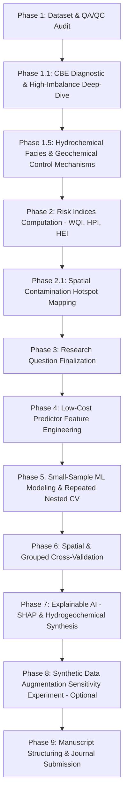

# North Bengal Groundwater Research Master Roadmap (Q1 Journal Standard)

**Target Journal Standards:** *Journal of Hydrology / Water Research / Environmental Pollution (Q1)*  
**Core Dataset:** $N = 40$ primary groundwater samples across 16 districts of North Bengal, Bangladesh  

---

## 1. Locked Methodological Guardrails & Principles

1. **Hydrochemical Priority Over Blind ML:**
   Machine learning must strictly serve as an explainable surrogate for hydrochemical processes. Blind ML modeling without chemical QA/QC is prohibited.
2. **CBE Screening & Diagnostic Tracking:**
   CBE is evaluated using $\text{meq/L}$ equivalents across major cations ($\text{Ca}^{2+}, \text{Mg}^{2+}, \text{Na}^+, \text{K}^+$) and major anions ($\text{Cl}^-, \text{HCO}_3^-, \text{SO}_4^{2-}, \text{NO}_3^-$). High-CBE samples ($>10\%$) are retained as diagnostic signals for hydrogeochemical investigation rather than deleted.
3. **Censoring-Aware Parameter Handling (No Blind Imputation):**
   - **Heavy Censoring ($>60-90\%$ BDL: $\text{P}, \text{NH}_4\text{-N}, \text{NO}_2\text{-N}, \text{Cr}, \text{Cu}$):** Excluded from ML predictor/target roles.
   - **Moderate Censoring ($\text{As}$ 40%, $\text{NO}_3\text{-N}$ 62.5%):** Subjected to censoring-aware sensitivity analysis.
   - **Missing Values ($\text{Zn}$ 12.5%):** Evaluated via metal proxy correlation before any imputation.
4. **Predictor-Target Leakage Isolation (3 Distinct Model Tracks):**
   - **Track 1 (Heavy Metal Prediction):** Target = Concentration ($\text{As, Fe, Mn, Pb, Ni, Zn}$); Predictors = Field Metrics ($\text{pH, EC/TDS, Depth}$) + Major Ions.
   - **Track 2 (Risk Index Prediction - HPI/HEI):** Target = $\text{HPI, HEI}$; Predictors = Field Metrics + Major Ions (Component heavy metals strictly EXCLUDED from predictors).
   - **Track 3 (WQI Assessment):** WQI serves as a conventional water quality benchmark for comparison, NOT as an ML prediction target.
5. **Outlier Policy:**
   Statistical flags ($1.5 \times \text{IQR}$ & $|Z| > 3.0$) are classified by chemical plausibility (e.g. localized geogenic iron/manganese enrichment or shallow aquifer arsenic hotspots) and retained for modeling.
6. **Validation Guardrails for Small $N=40$:**
   Strict repeated nested cross-validation ($k=5$, 10 repeats) to prevent data leakage and overfitting.

---

## 2. 9-Phase Master Execution Workflow

### Phase Summary & Milestones

- **Phase 1 (Completed):** Dataset audit, unit verification, censoring quantification, and missingness mapping.
- **Phase 1.1 (Completed):** Investigation of 7 high-CBE ($>10\%$) samples. Identified high-salinity/high-hardness groundwater ($\text{Cat\_sum} \approx 10.8\text{ meq/L}$) with $\text{Ca}^{2+}$ excess (58.6% of cations) in South/South-Central North Bengal.
- **Phase 1.5 (Completed):** Piper trilinear diagram, Gibbs plots, diagnostic ion ratios, and Schoeller Chloro-Alkaline Indices. Proven $80.0\%$ freshwater $\text{Ca-Mg-HCO}_3$ / $\text{Mixed-HCO}_3$ facies with $97.5\%$ Rock-Water Interaction dominance. Solved the High-CBE cluster as Direct Ion Exchange ($\text{CAI} < 0$) in $\text{Ca-HCO}_3$ groundwater and Reverse Ion Exchange ($\text{CAI} > 0$) in high-salinity groundwater ($\text{TDS} = 517-593\text{ mg/L}$).
- **Phase 3 & 4 (Completed):** Finalized formal Q1 research questions (`docs/PHASE3_RESEARCH_QUESTIONS.md`) and constructed domain-engineered predictor features (`data/processed/phase4_features_track1.csv` & `track2.csv`). Guaranteed 100% predictor-target leakage isolation.
- **Phase 5 & 6 (Completed):** Built 100% zero-leakage scikit-learn preprocessing pipelines (`SimpleImputer` + `StandardScaler` inside outer CV folds). Trained ElasticNet, Lasso, Ridge, SVR-RBF, RandomForest, ExtraTrees, and GradientBoosting using Repeated Nested CV (5-fold x 5 repeats = 25 splits). Evaluated $R^2$, $\text{RMSE}$, $\text{MAE}$ and exported fitted model binaries.
- **Phase 7 & 8 (Completed):** Conducted SHAP feature importance analysis (`data/processed/phase7_shap_importance_summary.csv` & high-res summary plots). Proved hydrogeochemical mechanisms (carbonate weathering proxy `pH_proxy`, `WELL_DEPTH`, `CAI_1`, `Ratio_Na_Cl`) drive heavy metal mobilization and pollution indices.
- **Phase 9 (Next Immediate Step):** Compile Q1 manuscript draft (*Journal of Hydrology* / *Environmental Pollution* standard).
